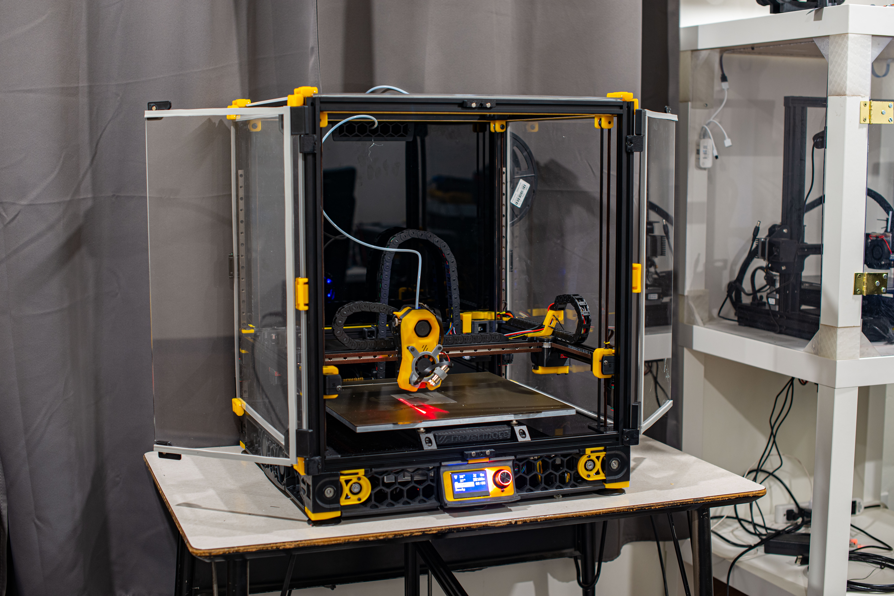
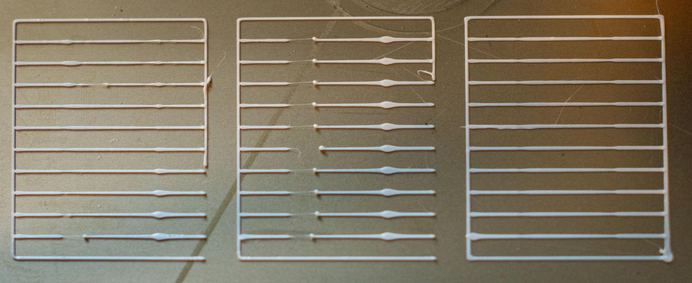
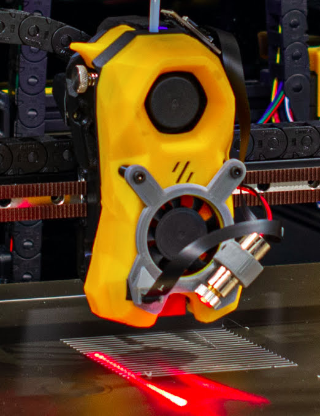
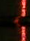
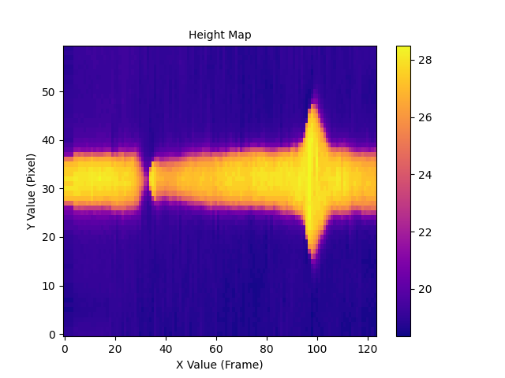
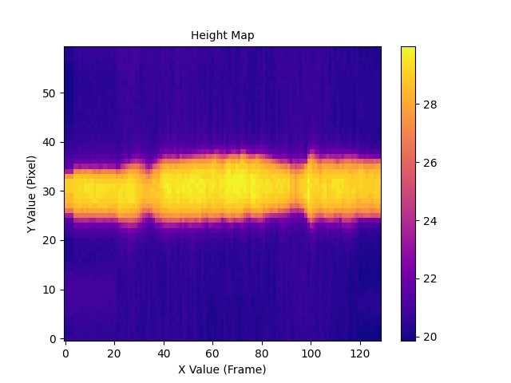
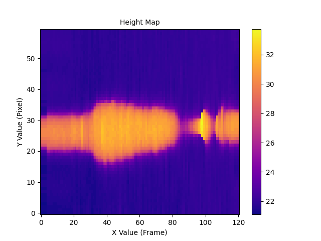
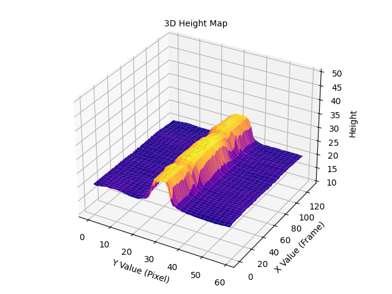

# Rubedo
## A tool for automatically calibrating pressure advance.
Do you hate manually tuning pressure advance?  Me too!  This script can use a line laser and camera that are attached to your printer's toolhead to generated a 3D model of a pressure advance calibration pattern, and estimate how badly each line is deformed. We can pick the best one, and use this as our pressure advance value.


*The system installed on my printer*


*On the left is the pattern that was scanned. The middle pattern shows the pattern printed with pressure advance disabled, and the pattern on the right shows a pattern printed with the calibrated value.*

***
### Disclaimer
This tool is still very much experimental. I hope that someday it will grow to be more robust and user friendly, but right now you should know at least a little bit of Python if you're interested in trying it out. It's not perfect. The gcode that is generated may not play nicely with your printer. I would recommend keeping the emergency stop button within close reach the first time you run the calibration, just to be safe.
***

## Things you will need to setup on your printer:
* Klipper + Moonraker. This project communicates with moonraker using websockets.
* A high quality USB camera. I used the 1080p nozzle camera from 3DO. The exact model I have is no longer available for purchase, [but they do have a 4k version](https://3do.dk/59-dyse-kamera). You will need to adjust several of the constants in `constants.py` folder to adjust the system to work with whatever camera you choose. The most important thing here is that the camera can focus on things at close distances. I think it might be possible to get a modified endoscope working with the system, but I tried one without modifications and I just couldn't get enough detail to make this work well at the default focus distance.
* A line laser, preferably with an adjustable focus. I tested a fixed focus laser earlier on, but the beam was super thick and there was no way to adjust it. I have a laser like [this](https://www.amazon.com/module-Industrial-Module-adjustable-point-2packs/dp/B0BX6Q9FD8/). It's capable of focusing at a fairly close distance, though I had to put some hot glue on the lens to keep it from rotating over time since it's fairly loose at the distances I'm using it at.  Also, the outer edges of the line are poorly focused because they're further away than the center of the line, but it hasn't been a huge issue since it's just important that the very center of the beam is very thin.
* `LASER_ON` and `LASER_OFF` macros. I have my laser connected to the SB2040 PCB on my toolhead. I used one of the 5v fan outputs, and it works fairly well.
* Some sort of a mount for your USB camera and laser. I am using the mount `3DO_Mount_v2.step` located in the `camera_mounts` directory. If you do not use this exact mount, you will need to adjust the constants for the X and Y camera offset.  In addition, you will need to ensure that the laser is at a 45° angle from the camera. Ideally, both the camera and laser will be most in focus exactly where the laser passes through the center of the camera's field of view. This was not the case with my hardware, so I have shift the area my code analyzes to the side a bit. If your camera is rotated differently than mine, it should be fairly easy to add another parameter to rotate the video feed, but I have not implemented that yet so you will need to figure that out yourself. There might be a way to do that with the ffmpeg arguments used.

Here's a closeup of the system attached to my printer.  I didn't have screws that were the right length, so I'm using some friction fit printed bushings and double sided tape to keep things together.



## On whatever device you want to run the calibration from:
* Install ffmpeg
* Install the following python modules: 
    ```
    opencv-python-headless matplotlib aiohttp websocket-client
    ```
* Clone this repository
* Go through the `constants.py` file, and adjust whatever you need to in order to make it match the way your printer is configured. 

### Configuring constants
Honestly, this is going to be a bit tricky, and is probably the most brittle part of the process.  Some of the config options, such as the camera X and Y offset are fairly straightforward. However, the crop settings are crucial to getting the system to work well. These are used by the `crop_frame()` function in `processing.py`, and if the resulting frame does not clearly show the area where the laser is hitting the filament, then this will not work at all. 

This image is what a cropped frame looks like on my machine. Perhaps I should shift the frame slightly further to the right. More experimentation needs to be performed to figure out exactly what the ideal setting is. The most important thing is that the camera should only see the line that it is currently scanning. You will need to take care to ensure that the line you're cropping to is not the wrong one.



```
TODO Add a simple script for calibrating this setting
```

Assuming you are using an adjustable focus line laser, you will need to move the print head to the height where the print bed is perfectly in focus. Then, you will need to adjust the focus of the line laser until the laser beam is as thin as you can get it. Make sure that the beam is also perfectly parallel with the Y axis. This is necessary in order to get a good scan data.

# Code Organization
The code that allows for hands free calibration is in `main.py`. Once you've configured everything correctly, you should be able to run the script and get recommended pressure advance value.  If you have `VALIDATE_RESULTS` enabled, the printer will print another two patterns, one w/ PA disabled, and another with the selected value. Most users probably won't want this, so feel free to turn it off.  It also makes it hard to find the recommended value in the scripts output.

If you want to test a different range of pressure advance values, or change where the calibration pattern is printed, you can do so by editing the parameters used for the PatternInfo object created at the start of the main function. By default, the pattern is printed at (30, 30), and tests 10 PA values between 0 and 0.06.

### `pa.py`
This file contains code for generating the calibration pattern gcode.

### `record.py`
This file contains functions for recording video clips of the printed lines.

### `processing.py`
This file contains a few utilities that filter and transform the video frames to help minimize noise.

### `analysis.py`
This file contains the code that generates height maps for each line, and then computes the line deviation for each heightmap.

### `visualization.py`
This file contains several utilities for visualizing the height maps and data that is generated from the scans. Currently, some of the functions here are in disrepair, as I needed the output during early development, but haven't used them since.

### `generate_bulk_scans.py`
This file will print 27 copies of the calibration pattern, scan all of them, and then save the results for later analysis. I used this while working on my research paper for this project to measure how consistent the system was.

### `generate_report_data.py`
This script consumes the files generated by the `generate_bulk_scans.py` script, and generates height map visualizations for each line that was scanned. In addition, it generates charts that aggregate the data from all scans to visualize the overal consistency of the calibration process.

# Visualization
Here are some heightmaps from lines that I scanned while working on this project.  They're a little bit squished together because the columns actually represent video frames, and not pixels or millimeters.


*PA at 0.13*


*PA at 0.33*


*PA at 0.60*


*Here's what the 0.33 line looks like in 3D*

# Results
I am working on a formal research paper that goes more in depth about the way the system works, but in the meantime, I have a video on youtube that gives an overview of everything.

# Additional Information
If you think this project is cool, there are a bunch of us on the Alchemical3D discord server that are working on a printer that will use this system.  In addition, we are excited about the prospect of using it to calibrate other things, such as extrusion multiplier or even bed mesh. Feel free to check it out:

[https://discord.gg/ByyEByP7hp](https://discord.gg/ByyEByP7hp)

# Support This Project
Like this project?  Feel free to make a donation.

[](https://ko-fi.com/L3L63ISSH)
